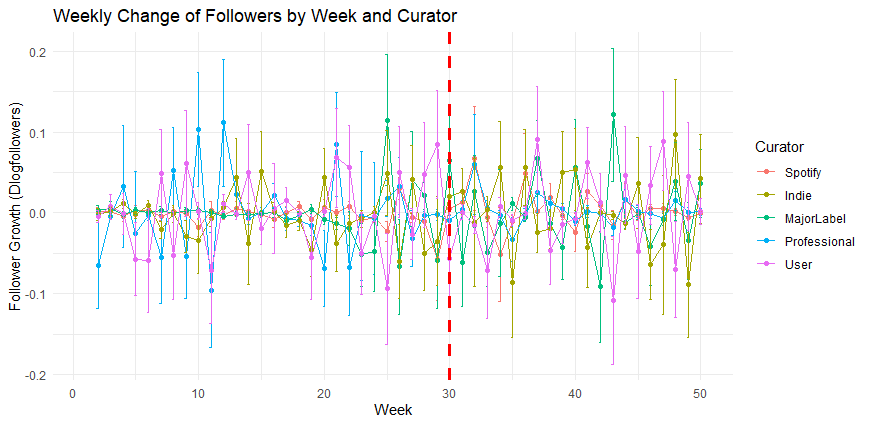
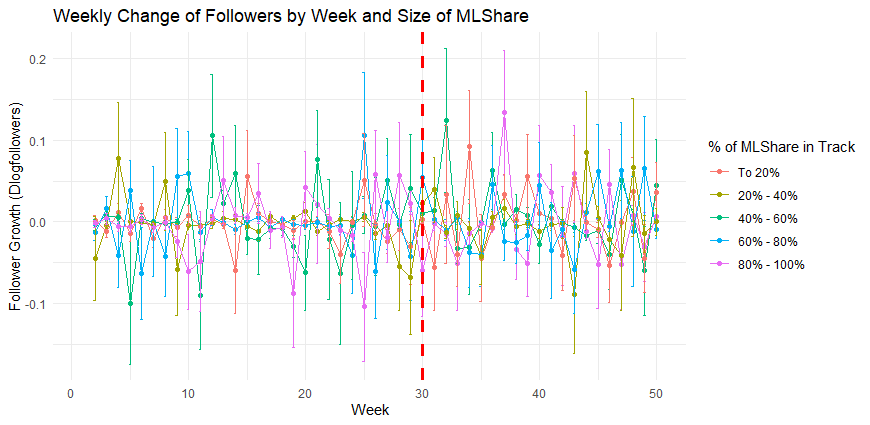
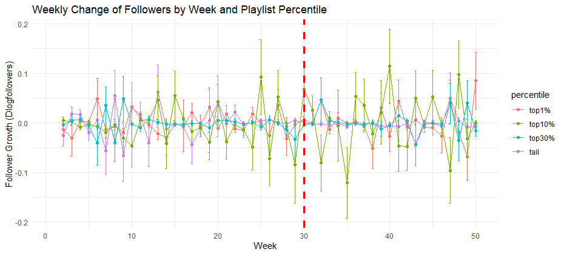
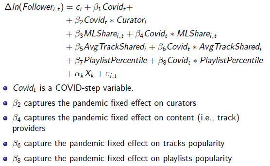
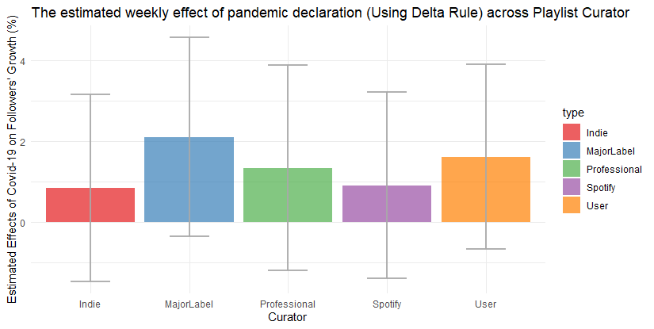
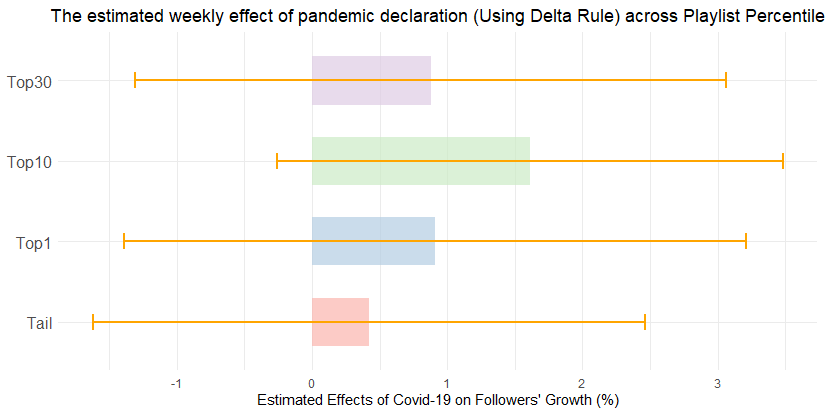

# Do The Winners Take It All? How Covid-19 Affected Playlist Followers on Spotify

### Author:
Tanetpong (Ned) Choungprayoon, [Max Pachali](https://sites.google.com/site/mjpachali/home), and [Hannes Datta](https://www.hannesdatta.com/)

## Abstract:
The COVID-19 pandemic has had impacts across various sectors, including the music industry. Despite the challenges posed by the pandemic, including restrictions on live performances, the user base of music streaming platforms has continued to expand. This study investigates the differential effects of the pandemic on the followers of platform playlists curated by various stakeholders, such as Spotify itself, major record labels, and independent labels. Utilizing a unique dataset comprising weekly follower counts from 29 October 2019 to 4 October 2020, we analyze the changes in followers for 39,918 playlists both before and after the pandemic's declaration. Through fixed effect modeling, we assess the pandemic's impact while controlling for genre and visibility on the platform's search page. Our findings indicate that Spotify-curated playlists exhibited the most resilience during the pandemic, with users showing a preference for playlists featuring more popular tracks over those with a higher share of major label content. The analysis also reveals a non-linear effect of playlist popularity, suggesting that while highly popular playlists experienced minimal disruption, the impact intensified for less popular, long-tail playlists. These insights not only reflect the pandemic's heterogeneous effects on the music streaming landscape but also highlight the strategic advantage of popular content curation during times of crisis.

## Overview
The purpose of this repository is to publish the empirical research project conducted as part of my doctoral dissertation and to make the analysis part (with R) accessible, potentially inspiring further study. [The slides related to this study](https://github.com/tanetpongc/spotify_covid-19/blob/a26c99a314671a0442a4cd98f8d74ef663b05573/slide_deck/Slides_spotifycovid19.pdf) are also available in this repository. The empirical data is (1) obtained from *Chartmetric.com*, a third-party company collecting the data via the Spotify Web API stored via **AWS** and (2) collected from from *Everynoise.com/worldbrowser.cgi*. This project made use of the Dutch national e-infrastructure with the support of the SURF Cooperative using grant no. EINF-2074. Additional fund for visit Tilburg University for project collaboration is supported by Torsten Söderbergs Stiftelse and Hans Werthénfonden.

`slide_deck` contains the most updated slides

`data` contains *df_playlists.csv* which is simulated data similar to our dataset regarding playlist information and *df_weekly.csv* (i.e. scanner data) which is simulated data similar to our dataset regarding follower (weekly) information. These two datasets used for the walkthrough and *Simulate_Data.R* illustrating how these datasets are simulated.

`analysis` contains Python code (*playlist_categorization.py*) used for **categorizing playlists genre by applying machine learning technique** and R code (*analysis.R*) used for **visualizing and analyzing effects of the pandemic on playlists' followers**


`gen` contains results from playlist classification (*df_playlists_cluster.csv*)

`img` contains equation and visualization used in the walkthrough


## Walkthrough with simulated data
### Required package
For this project, we mainly use `data.table` for data simulation, data aggregation, `ggplot2` for visualization, `plm` for estimating fixed effect (*[fixest](https://cran.r-project.org/web/packages/fixest/vignettes/fixest_walkthrough.html)* is also good alternative),`car` for calculating differential effect from curator and playlists percentile. For playlist classification using Python (adapted from [this repository](https://github.com/hannesdatta/spotify-playlist-categories)), we need `pandas `, `numpy` `mlxtend`
`os` library/module.

<details>
  <summary>Load required package (for R)</summary>

```R
library(data.table) 
library(ggplot2)
library(plm)
library(car) 
```
</details>

### The data
**Setting**: We simulated playlists' information data (i.e., name, genres, percentile in the platform) and their weekly attributes (i.e., followers, percentage of tracks produced by major label (ML), the number of tracks shared with other playlists). We assume the pandemic declaration is in week $30^{th}$ in our simulated dataset.
<details>
  <summary>Import data</summary>

```R
playlist_df <- fread("../data/df_playlists.csv")
playlist_weekly_df <- fread("../data/df_weekly.csv") 
playlist_cluster <- fread("../gen/df_playlists_cluster.csv") #use wide-format table for merging with assigned category

```
</details>

| Variable        | Description                                                  |
|---------------|------------------------------------------------------------|
| id    | Playlist id                                 |
| genre| Genre keywords (One playlists can have several genre keywords) |
| curator | Curator of the playlist (Spotify, Major Label, Indie, Professional, User)      |
| percentile| Playlists position in the platform follower distribution (Top 1%, Top 10%, Top 30& and Tail)             |
| week| Week number |
| MLShare| The percentage of tracks produced by major label (ML) in the playlist       |
| ntracksotherpl |on average, on how many playlists were tracks on this list added on the platform? |
| feature| = 1 if playlists being featured  in a session on the platform Search Page, otherwise 0|


### Playlist classification
We adopted [Pachali & Datta (2022)](https://papers.ssrn.com/sol3/papers.cfm?abstract_id=4079693)'s playlist categorization (i.e. association rule) method to assign our sample playlists to one or more relevant genres.

<details>
  <summary>Using Association Rule Mining from 100 playlists with minimum confidence of 0.9 and minimum support of 0.2, We get 140 total association rules for 12 clusters (plus playlist related to mood) to assign to all playlists</summary>

```python
import pandas as pd
import numpy as np
from mlxtend.frequent_patterns import apriori
from mlxtend.frequent_patterns import association_rules
import os
    
# ---------------------------- #
#          OBJECTIVE           #
# ---------------------------- #

# Input -> Playlists with one or several genre keywords
# Output -> Association rules using tag genre to map relevant genre for all playlists

# ---------------------------- #
#       DATA PREPARATION       #
# ---------------------------- #

# mood keywords and relevant genres
moods = {'mood', 'fuzzy', 'feel', 'rage', 'anger', 'angry', 'annoying', 'aggresive', 'interest', 'interesting', 'optimism', 'optimistic', 'ecstasy', 'joy', 'serenity', 'love', 'trust', 'acceptance', 'accepting', 'submission', 'terror', 'fear', 'awe', 'amaze', 'amazing', 'surprise', 'surprising', 'distraction', 'distracting', 'grief', 'sadness', 'sad', 'pensiveness', 'pensive', 'remorse', 'loathing', 'disgust', 'boredom', 'boring', 'bored', 'chill', 'active', 'cheerful', 'reflective', 'gloomy', 'humorous', 'humor', 'melancholy', 'romantic', 'mysterious', 'ominous', 'calm', 'lighthearted', 'hope', 'hopeful', 'fearful', 'tense', 'lonely', 'alone', 'happy', 'good', 'bad', 'suave', 'vibe', 'breakup', 'depressed', 'depression', 'emo', 'bored', 'heart broken'}
genres = {'blues','classical','country','edm','dance','funk','hiphop','indie','jazz','pop','rnb','rock'}

# read data
print("import data")
playlists = pd.read_csv('../data/df_playlists.csv') 
playlists_idtags = playlists[['id', 'genre']].drop_duplicates() #In case there is duplicated playlists

# prepare dataset, we need the data that each row has separate genre
def separate_genre_labels(playlist_df):
    playlist_genre = []
    for index, row in playlist_df.iterrows():
        targeted_genre = playlist_df.loc[index, "genre"]
        continue_in_code_step1=False
        if('str' in str(type(targeted_genre))): continue_in_code_step1 = True
        if('float' in str(type(targeted_genre))): continue_in_code_step1 = False
        
        if continue_in_code_step1 == False: continue

        if len(targeted_genre) > 0:
            for genre in targeted_genre.split(","): 
                    playlist_genre.append({
                        "id": playlist_df.loc[index, "id"],
                        "genre": genre.lower().strip()})
    return pd.DataFrame(playlist_genre)

playlists_df = separate_genre_labels(playlists_idtags)

# remove leading and trailing spaces and hyphens
playlists_df['genre'] = playlists_df['genre'].apply(lambda x: x.strip(" ")).apply(lambda x: x.replace("-", " "))

# create a random sample of playlists  for learning
np.random.seed(1) # for reproducbility (every time the same sample and thus identical association rules)
df_ids = playlists_df['id'].unique()
df_sample_ids = np.random.choice(df_ids, 5)
df_sample = playlists_df[playlists_df.id.isin(df_sample_ids)]

# turn data into pivot table as input for association rule mining (rows: playlists, columns: genre)
basket_sample = (df_sample.groupby(['id', 'genre'])['id']
   .count().unstack().reset_index().fillna(0)
   .set_index('id', drop=True))

# --------------------------------------- #
#       FIND MOODS-RELATED PLAYLIST      #
# ------------------------------------- #

def moods_playlists(moods):
    '''identify moods playlists from playlist names (i.e., check if keywords appear in the playlist name)'''
    output = pd.DataFrame()
    
    for tag in moods:
        matches = playlists[playlists.name.str.match(tag + "$|" + tag + "[ ]") == True].copy()
        if 'mood' in moods:
            matches['cluster'] = 'mood'
        output = pd.concat([output, matches]).reset_index(drop=True)
    return output[['id', 'cluster']]

# determine playlist ids related to moods
moods_matches = moods_playlists(moods) 
print("identified " + str(len(moods_matches)) + " moods playlists")


# ---------------------------- #
#   ASSOCIATION RULE MINING    #
# ---------------------------- #

def tag_word_analysis(basket, genre, min_confidence, min_support):
    ''''
    1. select all playlists that contain a given main genre (e.g., pop)
    2. derive association rules of length 2, of which the lift exceeds 1, the confidence is greater than 90%, and the support exceeds a given level
    3. consider association rules of which the consequent is the main genre (e.g., dance pop -> pop)
    '''
    tag_cluster = pd.DataFrame()

    basket_genre = basket[basket[genre] == 1] # all playlists that contain the main genre
    frequent_itemsets = apriori(basket_genre, min_support=min_support, use_colnames=True, max_len=2)
    rules = association_rules(frequent_itemsets, metric='lift', min_threshold=1).sort_values(['confidence', 'support'], ascending=False).reset_index(drop=True)
    rules = rules.loc[rules['confidence'] >= min_confidence, ['antecedents', 'consequents']]

    # restructure frozen set 
    for counter in range(len(rules)):
        antecedent, = rules.loc[counter, 'antecedents']
        consequent, = rules.loc[counter, 'consequents']
        if consequent == genre and antecedent not in genres: 
            tag_cluster_temp = pd.DataFrame([[antecedent, genre], [genre, genre]], columns=['genre', 'cluster'])
            tag_cluster = pd.concat([tag_cluster_temp, tag_cluster])
    tag_cluster = tag_cluster.drop_duplicates()
    
    return tag_cluster
    
# determine association rules within each main genre (note that one tagword may be associated with multiple clusters (e.g., soft rock -> rock & soft rock -> pop))
min_support=0.2 # changing the support level has a major impact on the outcomes (higher support = fewer association rules = fewer clusters)
min_confidence = .90
print("starting association rule mining with minimum confidence of " + str(min_confidence) + " and minimum support of " + str(min_support))
tag_clusters = pd.concat([tag_word_analysis(basket_sample, genre, min_support=min_support, min_confidence=min_confidence) for genre in genres])
print("With association rule mining with minimum confidence of " + str(min_confidence) + " and minimum support of " + str(min_support) + ", We get " + str(len(tag_clusters)) + " total association rules " + "for " + str(len(tag_clusters.cluster.unique())) + " clusters")
print("The final cluster includes " + str(tag_clusters.cluster.unique()))


# ------------------------------- #
#  ASSIGN PLAYLISTS TO CLUSTERS   #
# ------------------------------- #

# add clusters to all playlists df
df_cluster = pd.merge(playlists_df,tag_clusters, left_on='genre', right_on='genre')[['id', 'genre', 'cluster']]

    
# calculate number of playlists without any cluster (because none of the tagwords are related to any of the association rules; choosing a lower minimum support level will remedy this problem to a certain extent)
all_playlists = len(playlists_idtags.id.unique())
num_playlists_output = len(df_cluster.id.unique())
print("{0:.1f}% of all playlists is not assigned to any cluster".format((all_playlists - num_playlists_output) / all_playlists * 100))

# reshape data frame (rows: playlists, columns: clusters + mood)
playlist_cluster = pd.concat([moods_matches, df_cluster[['id', 'cluster']]]).drop_duplicates()
playlist_cluster['values'] = 1
df_pivot = playlist_cluster.pivot(index='id', columns='cluster', values='values').fillna(0)
#This returns the df (long-to-wide) with column: playlist_id, section_1, section_2,..., section_n meaning that one playlist can fit several main sectionName


# ------------------------------- #
#       CLUSTER STATISTICS		  #
# ------------------------------- #

# The number of followers is 'object' and for now we are interested in the number of playlist and its percentage to total dataframe

def calculate_cluster_indices(df_pivot):
    return {column: df_pivot.index[(df_pivot[column ] == 1)].tolist() for column in df_pivot.columns}


def cluster_stats(df_pivot, playlists):
    # collect playlist ids for each label
    cluster_indices = calculate_cluster_indices(df_pivot)

    # calculate number of followers and market share for each cluster
    cluster_stats = pd.DataFrame()
    for keys, values in cluster_indices.items():
        cluster_temp = pd.DataFrame({'label':keys, 
                                'num_playlists':len(values)}, 
                               index=[0])
        cluster_stats = pd.concat([cluster_temp, cluster_stats])
    
    cluster_stats['perc_playlists'] = cluster_stats['num_playlists'] / len(df_pivot) * 100
    print(cluster_stats.sort_values('perc_playlists', ascending=False).reset_index(drop=True))
    return cluster_stats


clusters_stats = cluster_stats(df_pivot, playlists)

# ------------------------------- #
#          EXPORT RESULTS         #
# ------------------------------- #

# WE GO FOR 1, 90%

#Make output directory
path = '../gen'
try:
    os.mkdir(path)
except:
    print('dir exists')
    
#Exportfile
df_pivot.to_csv(path + "/df_playlists_cluster.csv")

%reset -f
```
</details>

In our 500 playlists, we can categorize as follows:
| label    | num_playlists classified | (%) |
|----------|---------------|----------------|
| Rock     | 476           | 95.2           |
| R&B      | 480           | 96             |
| Pop      | 483           | 96.6           |
| Mood     | 393           | 78.6           |
| Jazz     | 479           | 95.8           |
| Indie    | 476           | 95.2           |
| Hiphop   | 477           | 95.4           |
| Funk     | 477           | 95.4           |
| EDM      | 479           | 95.8           |
| Dance    | 477           | 95.4           |
| Country  | 478           | 95.6           |
| Classical| 485           | 97             |
| Blues    | 473           | 94.6           |


### Model-free Evidence
<details>
  <summary>Merge relevant dataset and calculate relevant variables</summary>

```R
# Create covid step variable, include=FALSE}
playlist_weekly_df[, covid_step:= ifelse(week >= 30, 1, 0)]

# Imposing category
# Create key of id and playlist_id for merging
playlistcluster_df <- merge(playlist_cluster,playlist_df, by="id")
df <- playlist_weekly_df[playlistcluster_df, on = c("id"), nomatch = 0L] #nomatch = 0L argument ensures that only matching rows are returned (similar to a left join in SQL)

df[, id := as.factor(id)]
df[, week := as.factor(week)]
df[, covid_step := as.factor(covid_step)]
df[, curator := as.factor(curator)]
df[, curator := relevel(curator, ref = "Spotify")]
df[, percentile := as.factor(percentile)]
df[, percentile := factor(percentile, levels = c("top1%","top10%","top30%","tail"))] #So the graph shows nicely

rm(list = c("playlist_df","playlist_weekly_df", "playlist_cluster", "playlistcluster_df"))

#Create grand mean centering for category factor to avoid confusing interpretation related to genre
genres <- c('mood','blues','classical','country','edm','dance','funk','hiphop','indie','jazz','pop','rnb','rock')

for (i in genres) df[, paste0(i,'_mc'):=get(i)-mean(get(i))]

#Create relevant variables (first difference)
df[, log_followers := log(followers+1)]
setorder(df, id, week)
lag_1 <- function(x, k = 1) head(c(rep(NA, k), x), length(x))
df[, dlog_followers := log_followers-lag_1(log_followers), by = c('id')]
df[, dmlshare := MLShare-lag_1(MLShare), by = c('id')] 
df[, dlog_trackshare := log(ntracksotherpl)-log(lag_1(MLShare)), by = c('id')]
```
</details>
<details>
  <summary>Plot average change of followers over time by curator, MLShare and Percentile</summary>

```R
#MLShare
df[, MLSharegroup := cut(MLShare, breaks = c(0, 0.2, 0.4, 0.6, 0.8, 1), 
                                 labels = c("To 20%", "20% - 40%", "40% - 60%", "60% - 80%", "80% - 100%"), 
                                 include.lowest = TRUE)]
df_summary_byMLshare <- df[, .(followers_mean = mean(dlog_followers, na.rm = TRUE),
                     followers_se = sd(dlog_followers, na.rm = TRUE) / sqrt(.N)), 
                 by = .(week, MLSharegroup)]
df_summary_byMLshare[, week := as.numeric(as.character(week))]

ggplot(df_summary_byMLshare, aes(x = week, y = followers_mean, color = MLSharegroup)) + 
  geom_line() +  # Line plot for the means
  geom_point() + 
  geom_errorbar(aes(ymin = followers_mean - followers_se, ymax = followers_mean + followers_se), width = 0.2) +
  geom_vline(xintercept = 30, linetype = "dashed", color = "red", size = 1.2) +
  labs(
    x = "Week",
    y = "Follower Growth (Dlogfollowers)",
    color = "% of MLShare in Track",
    title = "Weekly Change of Followers by Week and Size of MLShare"
  ) +
  theme_minimal()

#Curator
df_summary_bycurator <- df[, .(followers_mean = mean(dlog_followers, na.rm = TRUE),
                     followers_se = sd(dlog_followers, na.rm = TRUE) / sqrt(.N)), 
                 by = .(week, curator)]
df_summary_bycurator[, week := as.numeric(as.character(week))]

ggplot(df_summary_bycurator, aes(x = week, y = followers_mean, color = curator)) + 
  geom_line() +  # Line plot for the means
  geom_point() + 
  geom_errorbar(aes(ymin = followers_mean - followers_se, ymax = followers_mean + followers_se), width = 0.2) +
  geom_vline(xintercept = 30, linetype = "dashed", color = "red", size = 1.2) +
  labs(
    x = "Week",
    y = "Follower Growth (Dlogfollowers)",
    color = "Curator",
    title = "Weekly Change of Followers by Week and Curator"
  ) +
  theme_minimal()

#Percentile
df_summary_bypercentile <- df[, .(followers_mean = mean(dlog_followers, na.rm = TRUE),
                               followers_se = sd(dlog_followers, na.rm = TRUE) / sqrt(.N)), 
                           by = .(week, percentile)]
df_summary_bypercentile[, week := as.numeric(as.character(week))]

ggplot(df_summary_bypercentile, aes(x = week, y = followers_mean, color = percentile)) + 
  geom_line() +  # Line plot for the means
  geom_point() + 
  geom_errorbar(aes(ymin = followers_mean - followers_se, ymax = followers_mean + followers_se), width = 0.2) +
  geom_vline(xintercept = 30, linetype = "dashed", color = "red", size = 1.2) +
  labs(
    x = "Week",
    y = "Follower Growth (Dlogfollowers)",
    color = "percentile",
    title = "Weekly Change of Followers by Week and Playlist Percentile"
  ) +
  theme_minimal()


```
</details>

<figure><figcaption></figcaption></figure>
<figure><figcaption></figcaption></figure>
<figure><figcaption></figcaption></figure>

* Heterogenous change in followers across playlists curated by different curators, having different size (or percentile), and composed of different tracks produced by major labels.

### Empirical Results
We employed fixed effect model on followers growth as follows:
<figure><figcaption></figcaption></figure>
<details>
  <summary>Estimating fixed effect</summary>

```R
m <- plm(dlog_followers ~ covid_step + covid_step*curator + covid_step*percentile 
         + covid_step*mood_mc + covid_step*blues_mc + covid_step*classical_mc + covid_step*country_mc 
         + covid_step*edm_mc + covid_step*dance_mc  + covid_step*funk_mc + covid_step*hiphop_mc 
         + covid_step*indie_mc + covid_step*jazz_mc + covid_step*pop_mc  + covid_step*rnb_mc + covid_step*rock_mc
         + covid_step*MLShare + covid_step*log(ntracksotherpl) + feature + week, data = df, index = c("id","week"), model = "within")
m_rob <- m
m_rob$vcov <- vcovHC(m, type = "HC1")

summary(m_rob)
```
</details>

<details>
  <summary>Visualizing Results</summary>

```R
# Function to perform delta method calculations
calculate_effects <- function(calcs_list, model) {
  calculations <- rbindlist(lapply(names(calcs_list), function(name) {
    res <- data.frame(deltaMethod(model, calcs_list[[name]]))
    colnames(res) <- c('est','se','q025','q975')
    res$type <- name
    res$est <- res$est * 100  # Convert to percentage
    res$se <- res$se * 100    # Convert to percentage
    return(res)
  }))
  return(calculations)
}

# Calculate different effects of curator
calcs_curator = list(Spotify='covid_step1', 
                     Indie="covid_step1+`covid_step1:curatorIndie`",
                     MajorLabel="covid_step1+`covid_step1:curatorMajorLabel`",
                     Professional="covid_step1+`covid_step1:curatorProfessional`",             
                     User="covid_step1+`covid_step1:curatorUser`"
)

m_rob_curatoreffect <- calculate_effects(calcs_curator, m_rob)

# Plot the effects of curator
ggplot(m_rob_curatoreffect, aes(x=type, y=est, fill = type)) +
  geom_bar(stat="identity", alpha=0.7) +
  geom_errorbar(aes(ymin=est-se, ymax=est+se), width=0.4, colour="darkgrey", alpha=0.9, size=0.9) +
  scale_fill_brewer(palette = "Set1") +
  theme_minimal() +
  labs(title ="The estimated weekly effect of pandemic declaration (Using Delta Rule) across Playlist Curator",x="Curator", y="Estimated Effects of Covid-19 on Followers' Growth (%)")

# Calculate different effects of percentile
calcs_percentile = list(Top1='covid_step1', 
                        Top10="covid_step1+`covid_step1:percentiletop10%`",
                        Top30="covid_step1+`covid_step1:percentiletop30%`",
                        Tail="covid_step1+`covid_step1:percentiletail`"
)

m_rob_percentileffect <- calculate_effects(calcs_percentile, m_rob)

# Plot the effects of percentile, choose different plot
ggplot(m_rob_percentileffect, aes(x = type, y = est, fill = type)) +
  geom_bar(stat = "identity", width = 0.6, alpha = 0.7) +
  geom_errorbar(aes(ymin = est - se, ymax = est + se), width = 0.2, colour = "orange", size = 1) +
  coord_flip() +  # Flip coordinates to make labels readable
  scale_fill_brewer(palette = "Pastel1") + e
  theme_minimal() +
  theme(
    legend.position = "none",  
    axis.title.y = element_blank(),  
    axis.text.y = element_text(size = 12),  
    plot.title = element_text(hjust = 0.5)  
  ) +
  labs(
    x = "Percentile Group",
    y = "Estimated Effects of Covid-19 on Followers' Growth (%)",
    title = "The estimated weekly effect of pandemic declaration (Using Delta Rule) across Playlist Percentile"
  )
```
</details>
<figure><figcaption></figcaption></figure>
<figure><figcaption></figcaption></figure>

* From our simulated data, we couldn't find any significant evidence of the effect of curator and playlists popularity (i.e., percentile in followers distribution) on followers' growth


|  Selected Coefficients                     | Dependent variable:dlog_followers  |
|-----------------------|----------------------|
| MLShare               | -0.003 (0.017)       |
| Covid*MLShare   | 0.009 (0.010)        |
| log(ntracksotherpl)   | -0.001 (0.002)       |
| Covid*log(ntracksotherpl) | 0.001 (0.001) |
*Note:* ^*p<0.1; ^**p<0.05; ^***p<0.01

* From our simulated data, we couldn't find any significant evidence of the effect of content providers (MLShare) and tracks' popularity (ntrackotherpl) on followers' growth

